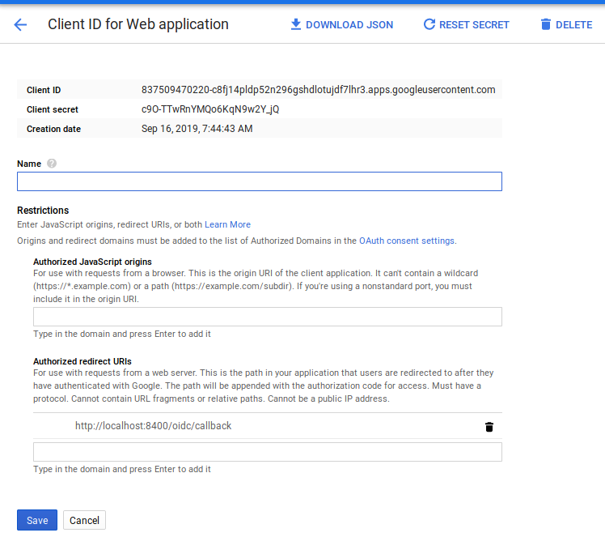
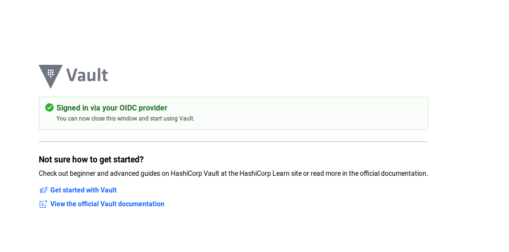
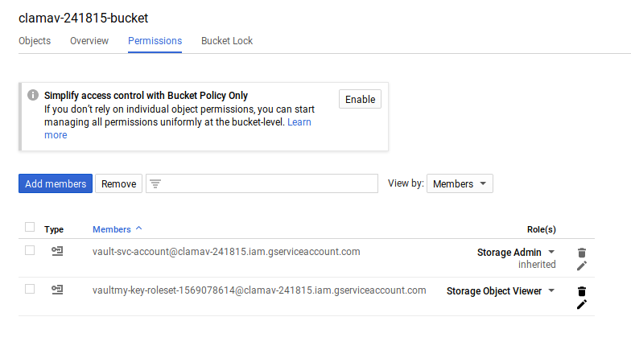
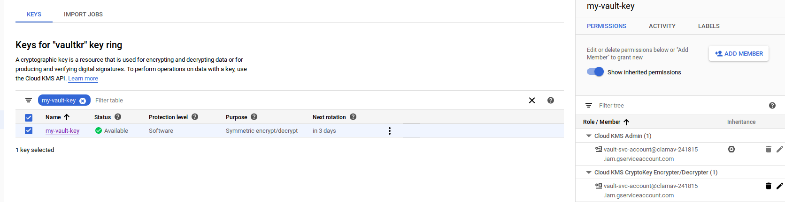

# Vault auth and secrets on GCP

Sample workflow covering basic use of Vault on GCP.

The specific aspects covered here:

1. Using GCP credentials to authenticate **TO** Vault (`vault login -method=gcp`) [Google Cloud Auth Method](https://www.vaultproject.io/docs/auth/gcp.html)
2. Using Vault to **GET** GCP secrets (`vault read gcp/token/...`)  [Google Cloud Secrets Engine](https://www.vaultproject.io/docs/secrets/gcp/index.html)
3. Using Vault to Encrypt/Decrypt a secret through Google Cloud KMS

In other words, for (1) use a Google Credential (OIDC Token) to authenticate TO Vault to get a Vault-native token `VAULT_TOKEN`

For (2) you use a Vault-native token (`VAULT_TOKEN`) to get a temporary Google `access_token` or the raw serviceAccount JSON key material for Google Cloud.

This article shows a basic setup for both scenarios in addition to basic Vault key-value and encryption endpoints (`/transit`).  I started looking into Vault recently as part of my work and found the two different capabilities a bit opaque so i started setting up and testing each of the features.  This article is nothing but an end-to-end of some of the Vault-GCP integration I came across.

It doe not cover running Vault in GKE or using kubernetes ServiceAccounts for Vault auth.  FOr that see [Vault Agent with Kubernetes](https://learn.hashicorp.com/vault/identity-access-management/vault-agent-k8s)


- [Setup](#Setup)
  * [Start Vault](#Start-Vault)
  * [Authorize Root Admin session](#Authorize-Root-Admin-session)
  * [Create a new Policy restricted token](#Create-a-new-Policy-restricted-token)
  * [Vault Secret](#Vault-Secret)
  * [Vault Encryption/Decryption (Transit Engine)](#Vault-Encryption/Decryption-(Transit-Engine))
- [GCP Vault Auth](#GCP-Vault-Auth)
  * [Vault auth for GCE instances](#Vault-auth-for-GCE-instances)
  * [Vault auth using Google OIDC](#Vault-auth-using-Google-OIDC)
- [GCP Vault Secrets](#GCP-Vault-Secrets)
  * [AccessToken](#AccessToken)
  * [ServiceAccount Key](#ServiceAccount-Key)
  * [KMS based secrets](#KMS-based-secrets)
- [Misc](#Misc)
  * [Asking Vault to return OIDC tokens](#Asking-Vault-to-return-OIDC-tokens)
  * [Asking Vault to return GCP JWTAccessToken](#Asking-Vault-to-return-GCP-JWTAccessToken)


## Setup

First we setup some environment variables we will resuse several times as well as the service account Vault will run as to provision services on GCP.

```bash
export PROJECT_ID=`gcloud config get-value core/project`
export PROJECT_NUMBER=`gcloud projects describe $PROJECT_ID --format="value(projectNumber)"`
export VAULT_SERVICE_ACCOUNT=vault-svc-account@$PROJECT_ID.iam.gserviceaccount.com

gcloud iam service-accounts create vault-svc-account --display-name "Vault Service Account"


gcloud iam service-accounts keys create vault-svc.json --iam-account=$VAULT_SERVICE_ACCOUNT 
gcloud projects add-iam-policy-binding $PROJECT_ID --member=serviceAccount:$VAULT_SERVICE_ACCOUNT --role=roles/iam.serviceAccountAdmin
gcloud projects add-iam-policy-binding $PROJECT_ID --member=serviceAccount:$VAULT_SERVICE_ACCOUNT --role=roles/iam.serviceAccountKeyAdmin
gcloud projects add-iam-policy-binding $PROJECT_ID --member=serviceAccount:$VAULT_SERVICE_ACCOUNT --role=roles/compute.viewer
gcloud projects add-iam-policy-binding $PROJECT_ID --member=serviceAccount:$VAULT_SERVICE_ACCOUNT --role=roles/storage.admin
```


### Start Vault

Start vault and bootstrap the GCP credentials it will use later during GCP secrets.

```bash
export GOOGLE_APPLICATION_CREDENTIALS=`pwd`/vault-svc.json

$ vault server --dev

             Api Address: http://127.0.0.1:8200
                     Cgo: disabled
         Cluster Address: https://127.0.0.1:8201
              Listener 1: tcp (addr: "127.0.0.1:8200", cluster address: "127.0.0.1:8201", max_request_duration: "1m30s", max_request_size: "33554432", tls: "disabled")
               Log Level: info
                   Mlock: supported: true, enabled: false
                 Storage: inmem
                 Version: Vault v1.3.0-dev
             Version Sha: d61d5b1166e049a3108bab1e7f8cc180e6e2a375+CHANGES

Unseal Key: MQVDpxAJPYefdydRBNpltjePZNtWZn+/Hdt3bScddDY=
Root Token: s.X7FsnjN5CQGwrp2tlMT4g2om
```

Note down the `Root Token`.  We will use that below for use in an "Admin" session

### Authorize Root Admin session

In a new window, export the Root Token

```
export VAULT_ADDR='http://localhost:8200'
export VAULT_TOKEN=s.X7FsnjN5CQGwrp2tlMT4g2om
```

```bash
$ vault status
Key             Value
---             -----
Seal Type       shamir
Initialized     true
Sealed          false
Total Shares    1
Threshold       1
Version         1.3.0-dev
Cluster Name    vault-cluster-77df4a3f
Cluster ID      733099f6-8464-0aae-3c59-038c34825bce
HA Enabled      false
```

Create policies to test basic vault operations. (note, these policies are permissive, its recommended to tune/restrict them)

```
vault policy write token-policy  token_policy.hcl

vault secrets enable -version=2  -path=kv kv
vault secrets enable transit
vault policy write secrets-policy  secrets_policy.hcl
vault write -f transit/keys/foo
```

### Create a new Policy restricted token

Now we'll create a new restricted token (note, this step is basic vault stuff unrelated directly to GCP functions.

```
vault token create -policy=token-policy  -policy=secrets-policy
```

You will see a new `token` and `token_accessor`.  Note them down; we will use these as the 'end user' tokens

```
$ vault token create -policy=token-policy  -policy=secrets-policy
Key                  Value
---                  -----
token                s.H2Ad0J78eSFT2OrcGRo5H8ai
token_accessor       sTUFeU5XFB0uekw6vAS4BjwY
token_duration       768h
token_renewable      true
token_policies       ["default" "secrets-policy" "token-policy"]
identity_policies    []
policies             ["default" "secrets-policy" "token-policy"]
```

This new token `s.H2Ad0J78eSFT2OrcGRo5H8ai` uses the policies you just defined in the `.hcl` files.  Those policies allows you to do basic
token, encryption and key/value operations

Open up another *new window* and export the token as an env-var

```
export VAULT_ADDR='http://localhost:8200'
export VAULT_TOKEN=s.H2Ad0J78eSFT2OrcGRo5H8ai
```

Now use the token to query information about itself (as provided by the `token_policy`):

```
$ vault token  lookup 

accessor            sTUFeU5XFB0uekw6vAS4BjwY
creation_time       1569024289
creation_ttl        768h
display_name        token
entity_id           n/a
expire_time         2019-10-22T20:04:49.143956789-04:00
explicit_max_ttl    0s
id                  s.H2Ad0J78eSFT2OrcGRo5H8ai
issue_time          2019-09-20T20:04:49.143956519-04:00
meta                <nil>
num_uses            0
orphan              false
path                auth/token/create
policies            [default secrets-policy token-policy]
renewable           true
ttl                 767h58m33s
type                service
```

And via its accessor:  

```bash
vault token lookup --accessor sTUFeU5XFB0uekw6vAS4BjwY

Key                 Value
---                 -----
accessor            sTUFeU5XFB0uekw6vAS4BjwY
creation_time       1569024289
creation_ttl        768h
display_name        token
entity_id           n/a
expire_time         2019-10-22T20:04:49.143956789-04:00
explicit_max_ttl    0s
id                  n/a
issue_time          2019-09-20T20:04:49.143956519-04:00
meta                <nil>
num_uses            0
orphan              false
path                auth/token/create
policies            [default secrets-policy token-policy]
renewable           true
ttl                 767h58m12s
type                service
```

Ok, all we've done here is shown that we can lookup info for the token as defined in the `.hcl` file

#### Vault Secret

Now use the new restricted token to put and then get a key-value into vault

```
Key              Value
---              -----
created_time     2019-09-21T00:07:20.40618114Z
deletion_time    n/a
destroyed        false
version          1

$ vault kv get kv/message
====== Metadata ======
Key              Value
---              -----
created_time     2019-09-21T00:07:20.40618114Z
deletion_time    n/a
destroyed        false
version          1

=== Data ===
Key    Value
---    -----
foo    world
```

So this shows basic key-value storage for Vault


#### Vault Encryption/Decryption (Transit Engine)

Now we'll test out the [transit](https://www.vaultproject.io/docs/secrets/transit/index.html) endpoint to encrypt/decrypt some data.

Encrypt:
```
echo -n "the quick brown fox" | base64 | vault write transit/encrypt/foo plaintext=-
Key           Value
---           -----
ciphertext    vault:v1:vvL11NeV7d4XbS3mg9ef8R83R2jmo0qFK+W3S+PWBfj7Pd5MHf5IJzuJJGbiV5w=
```

Decrypt:

```
vault write transit/decrypt/foo ciphertext=vault:v1:vvL11NeV7d4XbS3mg9ef8R83R2jmo0qFK+W3S+PWBfj7Pd5MHf5IJzuJJGbiV5w=

echo "dGhlIHF1aWNrIGJyb3duIGZveA===" | base64 -d

```

## GCP Vault Auth

Ok, now we're going to finally test GCP Vault Auth.  Again, this is authenticating **TO** vault using a ServiceAccount JWT

- [Google Cloud Auth Method](https://www.vaultproject.io/api/auth/gcp/index.html)

We will exchange a self-signed JWT Token issued by generic service account for and get a Vault-native token.

That is, you will start off with a Google Service Account JSON file, then use that to create a self-signed JWT.

The JWT that you will create will have an audience field for the role you define.  In the example below, the `aud:` field is `http://vault/my-iam-role`.

Once you mint the JWT, send that JWT to Vault for authentication.  Vault will respond back with its own `VAULT_AUTH` token you can use as usual with Vault.


In the **Admin window**, run the following to create a service account and associate it with vault to map them together.

Initialize GCP credentails for Vault

```
export VAULT_ADDR='http://localhost:8200'
vault auth enable gcp
```

Now create a new service account.  This is the service account a user will have and use to authenticate against vault.

```bash
export PROJECT_ID=`gcloud config get-value core/project`
export GENERIC_SERVICE_ACCOUNT=generic-svc-account@$PROJECT_ID.iam.gserviceaccount.com
export VAULT_SERVICE_ACCOUNT=vault-svc-account@$PROJECT_ID.iam.gserviceaccount.com

gcloud iam service-accounts create generic-svc-account --display-name "Generic Service Account"
gcloud iam service-accounts keys create generic-svc.json --iam-account=$GENERIC_SERVICE_ACCOUNT 
```

Now assign a vault role maps the service account into a role.

```bash
vault write auth/gcp/role/my-iam-role \
    type="iam" \
    policies="token-policy,secrets-policy" max_jwt_exp=60m \
    bound_service_accounts="$GENERIC_SERVICE_ACCOUNT"
```

Then in a new window, get the ID token for the given service account. Notice the audience is specifically for the role we just created `role/my-jwt-role`

```bash
vault login -method=gcp \
    role="my-iam-role" \
    service_account="$GENERIC_SERVICE_ACCOUNT" \
    project="$PROJECT_ID" \
    jwt_exp="15m" \
    credentials=@generic-svc.json
```

you'll see:
```
Error authenticating: unable to sign JWT for projects/clamav-241815/serviceAccounts/generic-svc-account@clamav-241815.iam.gserviceaccount.com using given Vault credentials: googleapi: Error 403: Permission iam.serviceAccounts.signJwt is required to perform this operation on service account projects/clamav-241815/serviceAccounts/generic-svc-account@clamav-241815.iam.gserviceaccount.com., forbidden
```

whooops...why is that?   Well Vault uses an IAM API itself to sign a JWT (i.,e [iamcredentials.signJWT](https://cloud.google.com/iam/reference/rest/v1/projects.serviceAccounts/signJwt)).  So lets do that:


```
$ gcloud iam service-accounts  add-iam-policy-binding $GENERIC_SERVICE_ACCOUNT --member=serviceAccount:$GENERIC_SERVICE_ACCOUNT --role=p=roles/iam.serviceAccountTokenCreator
```
then run the `vault login` command from above and you'll see 

```
Key                                 Value
---                                 -----
token                               s.Au2B1azdJnWTHCfc1gBDEwDK
token_accessor                      t1lkQDiaHh21Cjb9e2a1SXfF
token_duration                      768h
token_renewable                     true
token_policies                      ["default" "secrets-policy" "token-policy"]
identity_policies                   []
policies                            ["default" "secrets-policy" "token-policy"]
token_meta_service_account_email    generic-svc-account@clamav-241815.iam.gserviceaccount.com
token_meta_service_account_id       106138769222785354498
token_meta_project_id               clamav-241815
token_meta_role                     my-iam-role
```

..but wait, its just signing a JWT using a private thats you already have right there!! (`@generic-svc.json`)?!

Can't we just use the service account we already to sign?  Ofcourse..

Run the go snippet provided here and get the self-signed JWT token

```
go run main.go  --serviceAccountFile=`pwd`/generic-svc.json --expIn 3600 --audience "http://vault/my-iam-role" --expIn=3600 --logtostderr=1 -v 5
```

If you [decode](https://jwt.io/) the JWT, it will look like: 

```json
{
  "alg": "RS256",
  "kid": "fb9686314a329255860d4da250b2f559ce7a10c0",
  "typ": "JWT"
}.
{
  "aud": "http://vault/my-iam-role",
  "exp": 1569031729,
  "sub": "generic-svc-account@clamav-241815.iam.gserviceaccount.com"
}
```

Now export the token in an env var
```
export VAULT_ADDR='http://localhost:8200'
export TOKEN=<the_token>
```

and use that JWT token to authenticate *TO* vault

```bash
vault write -field=token auth/gcp/login     role="my-iam-role"      jwt="$TOKEN"
```

You should see a Vault Auth token in response
```
s.ApYGAVhc08fwgNfQkcvTPnVK
```

Either way, you can *another window*, export this token and use it as ususal as in the examples for `kv` and `transit` encryption above (that will work since we authorized it with the same acl)

```
$ export VAULT_ADDR='http://localhost:8200'
$ export VAULT_TOKEN=s.ApYGAVhc08fwgNfQkcvTPnVK

$ vault token  lookup

Key                 Value
---                 -----
accessor            D1vyqfzqWKgPgaUSoscPHuHW
creation_time       1569028459
creation_ttl        768h
display_name        gcp-generic-svc-account@clamav-241815.iam.gserviceaccount.com
entity_id           c4930d2b-c87a-0892-5c23-7f78e4fc6764
expire_time         2019-10-22T21:14:19.373153107-04:00
explicit_max_ttl    0s
id                  s.ApYGAVhc08fwgNfQkcvTPnVK
issue_time          2019-09-20T21:14:19.373152536-04:00
meta                map[project_id:clamav-241815 role:my-iam-role service_account_email:generic-svc-account@clamav-241815.iam.gserviceaccount.com service_account_id:106138769222785354498]
num_uses            0
orphan              true
path                auth/gcp/login
policies            [default secrets-policy token-policy]
renewable           true
ttl                 767h58m12s
type                service
```

### Vault auth for GCE instances

Vault can also authenticate compute engine instances using the GCE instances [instance identity document](https://cloud.google.com/compute/docs/instances/verifying-instance-identity).  The identity document is simplay a Google signed OIDC token which can be verified against a public certificate google provides.

>> Frankly, this is what vault should be using to authenticate even service account.   The previous section authenticates a service account using a "self-signed" JWT...but what really asserts identity is a google OIDC token.  For more information, see [google_id_token](https://github.com/salrashid123/google_id_token)


Anyway, in the **Admin window**, run the following to create the endpoint:


```
$ gcloud compute instances create iam-1 --zone us-central1-a

$ export GCE_SVC_ACCOUNT=`gcloud compute instances describe iam-1 --format="value(serviceAccounts[].email)"`
```

```
$ vault auth enable gcp
$ vault write auth/gcp/role/my-gce-role \
    type="gce" \
    policies="token-policy,secrets-policy" \
    bound_projects="$PROJECT_ID" \
    bound_service_accounts="$GCE_SVC_ACCOUNT"
```

Then create a GCE instance and within that get an oidc token with `&format=FULL` and the audience that specifies our vault role (remember to copy the `TOKEN` part but remove `Connection to ...` trailer)

```
$  gcloud compute ssh iam-1 -- -t "curl -s -H 'Metadata-Flavor: Google' http://metadata.google.internal/computeMetadata/v1/instance/service-accounts/default/identity?audience=http://vault/my-gce-role\&format=full; echo ''"
```

The following shows a sample OIDC token that gets returned by the metadata server.

```json
{
  "alg": "RS256",
  "kid": "0b0bf186743471a1edcac3060d1256f9e4050ba8",
  "typ": "JWT"
}.
{
  "aud": "http://vault/my-gce-role",
  "azp": "100368210816668891989",
  "email": "837509470220-compute@developer.gserviceaccount.com",
  "email_verified": true,
  "exp": 1569087045,
  "google": {
    "compute_engine": {
      "instance_creation_timestamp": 1569080987,
      "instance_id": "2407269007706814584",
      "instance_name": "iam-1",
      "project_id": "clamav-241815",
      "project_number": 837509470220,
      "zone": "us-central1-a"
    }
  },
  "iat": 1569083445,
  "iss": "https://accounts.google.com",
  "sub": "100368210816668891989"
}
```


 ```
 export VAULT_ADDR='http://localhost:8200'
 export TOKEN=<id_token>
 ```

Now try to get a vault token and use as normal

```
$ vault write -field=token auth/gcp/login     role="my-gce-role"      jwt="$TOKEN"
  s.5F7A8eDEPXx7OWIrvaFkViOp
```

```
$ export VAULT_TOKEN=s.5F7A8eDEPXx7OWIrvaFkViOp

$ vault token lookup

Key                 Value
---                 -----
accessor            1u0xYXdEnraiRqvMSaBn3rN6
creation_time       1569088587
creation_ttl        768h
display_name        gcp-iam-1
entity_id           3f8df349-8985-6fd8-3e47-a29c461c965d
expire_time         2019-10-23T13:56:27.51469795-04:00
explicit_max_ttl    0s
id                  s.5F7A8eDEPXx7OWIrvaFkViOp
issue_time          2019-09-21T13:56:27.514697471-04:00
meta                map[instance_creation_timestamp:1569080987 instance_id:2407269007706814584 instance_name:iam-1 project_id:clamav-241815 project_number:837509470220 role:my-gce-role service_account_email:837509470220-compute@developer.gserviceaccount.com service_account_id:100368210816668891989 zone:us-central1-a]
num_uses            0
orphan              true
path                auth/gcp/login
policies            [default secrets-policy token-policy]
renewable           true
ttl                 767h59m11s
type                service
```

### Vault auth using Google OIDC

In the **Admin window**, run the following to create a `client_id` and `client_secret` as documented [here](https://www.vaultproject.io/docs/auth/jwt_oidc_providers.html#google).   Remember to set the "Authorized redirect URIs" to include `http://localhost:8400/oidc/callback`

Once you have those, enable the auth mechanism and continue to setup vault to allow OIDC from google:



```
vault auth enable oidc

export CLIENT_ID=837509470220-c8fj14pldp52n296gshdlotujdf7lhr3.apps.googleusercontent.com
export CLIENT_SECRET=c9O-TTwRnYMQo6KqN9w2Y_jQ

vault write auth/oidc/role/tokensecrets \
        bound_audiences="$CLIENT_ID" \
        allowed_redirect_uris="http://localhost:8200/ui/vault/auth/oidc/oidc/callback" \
        allowed_redirect_uris="http://localhost:8250/oidc/callback" \
        user_claim="sub" \
        policies="token-policy,secrets-policy"

vault write auth/oidc/config oidc_client_id="$CLIENT_ID"  oidc_client_secret="$CLIENT_SECRET"  oidc_discovery_url=https://accounts.google.com default_role=tokensecrets
```

Now, in a *new window*, initalize a login session:

```
export VAULT_ADDR='http://localhost:8200'
vault login -method=oidc port=8400 role=tokensecrets
```

You should see a browser window popup.  Once you login, your OIDC token will get sent to Vault which will proceed to authenticate/verify the token.  Once verified, vault will return its own token with the `tokensecrets` role which inturn would include `token-policy,secrets-policy`.



For example, the flow maybe:

```bash
$ vault login -method=oidc port=8400 role=tokensecrets
Complete the login via your OIDC provider. Launching browser to:

    https://accounts.google.com/o/oauth2/v2/auth?client_id=837509470220-c8fj14pldp52n296gshdlotujdf7lhr3.apps.googleusercontent.com&nonce=bed71d812d997baad01325424e740f3d4857f6c0&redirect_uri=http%3A%2F%2Flocalhost%3A8400%2Foidc%2Fcallback&response_type=code&scope=openid&state=78abc0c4f0fc7ff16068c8da7e356f1ec0e7bb57


Success! You are now authenticated. The token information displayed below
is already stored in the token helper. You do NOT need to run "vault login"
again. Future Vault requests will automatically use this token.

Key                  Value
---                  -----
token                s.9v1LCGzSah1UJCJd11ANpdK9
token_accessor       EQj0QFalxw9RIQCb4sxuE4Ap
token_duration       768h
token_renewable      true
token_policies       ["default" "secrets-policy" "token-policy"]
identity_policies    []
policies             ["default" "secrets-policy" "token-policy"]
token_meta_role      tokensecrets
```

---

## GCP Vault Secrets

### AccessToken

In the **Admin window**, run the following to enable the gcp secres and to create a policy that will allow you to get a token to access a GCS Bucket.

```
vault secrets enable gcp

export BUCKET=$PROJECT_ID-bucket
gsutil mb gs://$BUCKET
cat <<EOF > gcs.hcl
resource "buckets/$BUCKET" {
        roles = ["roles/storage.objectViewer"]
}
EOF

vault write gcp/roleset/my-token-roleset    project="$PROJECT_ID"    secret_type="access_token"     token_scopes="https://www.googleapis.com/auth/cloud-platform"    bindings=@gcs.hcl
```

Now notice that you have a new Service account created by Vault

```bash
gcloud iam service-accounts list --format="value(email)"

generic-svc-account@$PROJECT_ID.iam.gserviceaccount.com
vaultmy-token-roles-1569029072@$PROJECT_ID.iam.gserviceaccount.com   <<<<<<<<
vault-svc-account@$PROJECT_ID.iam.gserviceaccount.com
```

Create a new window and export the restricted token we set at the very beginning `s.H2Ad0J78eSFT2OrcGRo5H8ai`


```bash
export PROJECT_ID=`gcloud config get-value core/project`
export VAULT_ADDR='http://localhost:8200'
export BUCKET=$PROJECT_ID-bucket

export VAULT_TOKEN=s.H2Ad0J78eSFT2OrcGRo5H8ai

vault read gcp/token/my-token-roleset
Key                   Value
---                   -----
expires_at_seconds    1568631008
token                 ya29.c.ElqFB2Lax07ndRSNbPWr84xdrNl-RqiDvgfEMKyhpCjanBQ7-redacted
token_ttl             59m59s
```
This works because we placed a rule into `secrets_policy.hcl`:

```hcl
path "gcp/token/my-token-roleset" {
    capabilities = ["read"]
}
```

Now use the `access_token` in a GCS API Call

```
export ACCESS_TOKEN=<your_token>
curl -H "Authorization: Bearer $ACCESS_TOKEN" https://www.googleapis.com/storage/v1/b/$BUCKET/o
```

Now deleting the vault roleset also deletes the temp service account it setup in the _authorized Admin terminal_

```
vault delete gcp/roleset/my-token-roleset 

gcloud iam service-accounts list --format="value(email)"
vault-svc@$PROJECT_ID.iam.gserviceaccount.com
```

### ServiceAccount Key

Vault auth can also return the **RAW** service account key material inline...basically the temporary raw key.

_This endpoint generates a new GCP IAM service account key associated with the roleset's Service Account. When the lease expires (or is revoked early), the Service Account key will be deleted._

Editorial: I'm not sure why the full raw key is ever exported outside of Vault...it'd be better to just expose capabilities from within Vault itself (eg, sign, getAccessToken(), etc)

Anyway, to export temporary generated key, first create the role to bind a key to the GCS bucket IAM permissions we setup earlier:

```
vault write gcp/roleset/my-key-roleset \
    project="$PROJECT_ID" \
    secret_type="service_account_key"  \
    bindings=@gcs.hcl
```

Now read the service key material back

```
$ vault read gcp/key/my-key-roleset
Key                 Value
---                 -----
lease_id            gcp/key/my-key-roleset/DwvuEAvpWXyomEu9uKmc7Ncc
lease_duration      768h
lease_renewable     true
key_algorithm       KEY_ALG_RSA_2048
key_type            TYPE_GOOGLE_CREDENTIALS_FILE
private_key_data    ewogICJ0eXBl<redacted>  <<<<<<<
```

Notice a new service account key was created

```bash
$ gcloud iam service-accounts list --format="value(email)"

vaultmy-key-roleset-1569078614@clamav-241815.iam.gserviceaccount.com  <<<<
generic-svc-account@$PROJECT_ID.iam.gserviceaccount.com
vault-svc-account@$PROJECT_ID.iam.gserviceaccount.com
```

And the permissions were added onto the bucket we requested per the `gcs.hcl` configuration



To delete the generated service account, run

```
$ vault delete gcp/roleset/my-key-roleset
```

### KMS based secrets

In this mode, you use Vault to encrypt/decrypt a small amount of data but the actual key that is used is saved in Google Cloud KMS.  For more informatin, see [Introducing the Cloud KMS plugin for HashiCorp Vault](https://cloud.google.com/blog/products/identity-security/introducing-the-cloud-kms-plugin-for-hashicorp-vault)

In the **Admin window**, first create the Keyring that Vault will use.  

```
export VAULT_KMS_KEYRING=vaultkr
export VAULT_KMS_KEY_1=my-vault-key


gcloud kms keyrings create $VAULT_KMS_KEYRING  --location global

gcloud kms keyrings add-iam-policy-binding $VAULT_KMS_KEYRING  --location global --member=serviceAccount:$VAULT_SERVICE_ACCOUNT     --role='roles/cloudkms.admin'

```



Now enable the KMS secrets backend and follow the article above to bind a KMS backed key.  Vault will automatically create a KMS key but you will have to separately allow Vault to use it to encrypt/decrypt 

```
$ vault secrets enable gcpkms
$ vault write gcpkms/keys/my-vault-key   key_ring=projects/$PROJECT_ID/locations/global/keyRings/$VAULT_KMS_KEYRING   rotation_period=72h

$ gcloud kms keys add-iam-policy-binding $VAULT_KMS_KEY_1 --keyring $VAULT_KMS_KEYRING --location global --member=serviceAccount:$VAULT_SERVICE_ACCOUNT     --role='roles/cloudkms.cryptoKeyEncrypterDecrypter'

```

Now use the KMS key to encrypt and decrypt:

```
$ vault write gcpkms/encrypt/my-vault-key plaintext="hello world"
Key            Value
---            -----
ciphertext     CiQAUcaXuBHC069MPabYTgMrlMM3v9Y3YLFnnhgok3MOifRFJ2QSNADA8Jp997Y/b3WLk95itDJpOWoVitURBHdfMUJK92JMc4kbQUoG4RvPvrpxZd7/Tci0gwI=
key_version    1

```

```
$ vault write gcpkms/decrypt/my-vault-key ciphertext="CiQAUcaXuBHC069MPabYTgMrlMM3v9Y3YLFnnhgok3MOifRFJ2QSNADA8Jp997Y/b3WLk95itDJpOWoVitURBHdfMUJK92JMc4kbQUoG4RvPvrpxZd7/Tci0gwI="
Key          Value
---          -----
plaintext    hello world
```

Once you delete the Vault key, the KMS key is also deleted

```
$ vault delete gcpkms/keys/my-vault-key
```

## Misc

### Vault Enhancement Feature Requests

The following are just enhancements to Vault-GCP secrets plugin I requested:

#### Asking Vault to return OIDC tokens

This feature will return an OpenID Connect token that represents the service account that gets generated:

- [https://github.com/hashicorp/vault-plugin-secrets-gcp/issues/46](https://github.com/hashicorp/vault-plugin-secrets-gcp/issues/46)

#### Asking Vault to return GCP JWTAccessToken

This feature will return a `JWTAccessToken` to use as a substitute to traditional oauth2 `access_token` when accessing GCP APIs.

- [https://github.com/hashicorp/vault-plugin-secrets-gcp/issues/47](https://github.com/hashicorp/vault-plugin-secrets-gcp/issues/47)

For more information, see [Faster ServiceAccount authentication for Google Cloud Platform APIs](https://medium.com/google-cloud/faster-serviceaccount-authentication-for-google-cloud-platform-apis-f1355abc14b2)


---

Thats it...this is nothing new, you can read the docs that cover it anyway but the way i understand things is to do them by hand.  Hope you found this useful.
